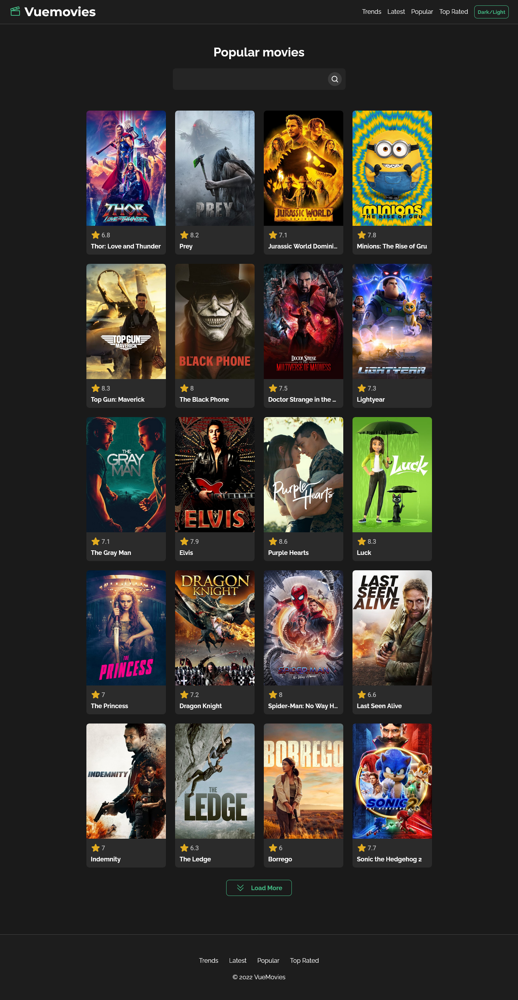

# 🎬Vuemovies

## 🤨 O que é?

Vuemovies é um site onde é possível explorar informações de filmes, é possível ver os filmes populares atualizados diariamente e pesquisar um filme especifico.

Além das informações do filme, também é possível ver os atores da produção, produtoras, orçamento e receita.

este projeto foi feito para praticar com o framework [Vue.js](https://vuejs.org/) e também aprender a consumir uma API: [The Movie Database (TMDB) API](https://developers.themoviedb.org/3/getting-started/introduction)

## 💻 Screenshot

## Contato

